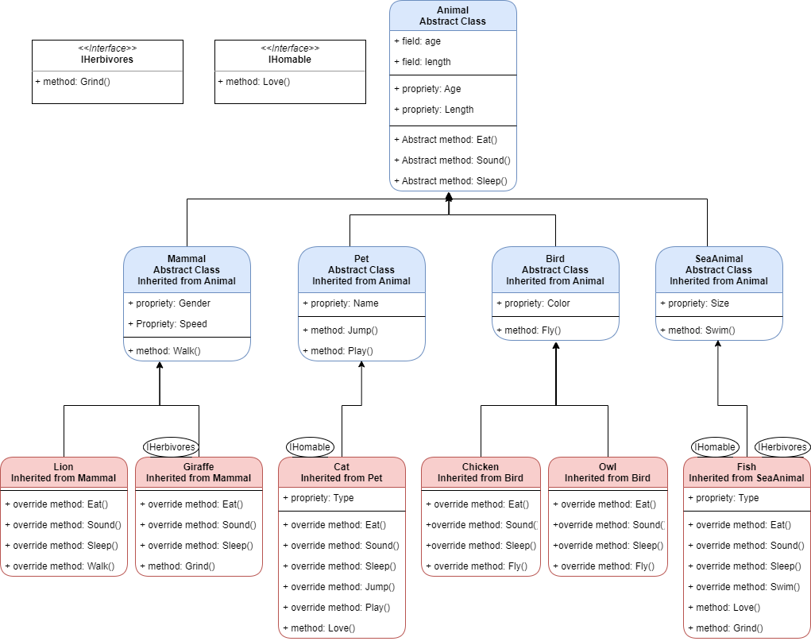

# Lab06-07-IbuiltAZoo
This Project aim to represent a Zoo into a Console application with classes for different Animals visualized by UML class diagram.\

## UML Diagram
 

## OOP Principles:
### Inheritance:
Ability to create new abstractions based on existing abstractions.
1. ``Pet`` Class is inherited from ``Animal`` Class.
2. ``Cat`` Class is inherited from ``Pet`` Class.

### Abstraction:
Modeling the relevant attributes and interactions of entities as classes to define an abstract representation of a system.
1. ``Animal`` Class and it's methods are abstract, we have to override them in every child class.
2. ``Mammal`` Class is abstract.

### Encapsulation:
Hiding the internal state and functionality of an object and only allowing access through a public set of functions.
1. In ``Animal`` Class ``Age`` properity is private, it has get and set to be accsesed from any child Class.
2. In ``Animal`` Class ``Length`` properity is private, it has get and set to be accsesed from any child Class.

### Polymorphism:
Ability to implement inherited properties or methods in different ways across multiple abstractions.
1. ``Mammal`` Class have ``Walk`` properity, ``Lion`` Class override it and change it a little.
2. ``Bird`` Class have ``Fly`` properity, ``Owl`` Class override it and change it a little.